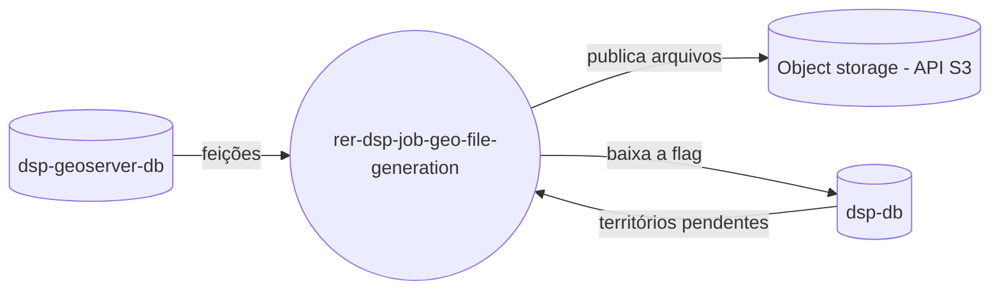

# rer-dsp-job-geo-file-generation

> Este repositório é um dos módulos do **DSP (Data Sharing Platform)**, parte do ecossistema RER.
> A documentação completa do projeto está em **[rer-dsp-docs](https://github.com/Rural-Environmental-Registry/rer-dsp-docs)**.
> As informações abaixo tratam apenas deste módulo, não do projeto DSP como um todo.

## Qual parte do DSP este módulo é



## Objetivo

Pré-gerar os arquivos de download territoriais (níveis 2 e 3) e publicá-los em um object
storage com API S3, para que o backend não precise consultar o WFS a cada download.

## Como funciona

1. A migração ([`rer-dsp-job-data-migration`](https://github.com/Rural-Environmental-Registry/rer-dsp-job-data-migration))
   liga `requires_s3_file_regeneration` nos territórios que mudaram, apenas depois de terminar
   com sucesso.
2. Este job lê os territórios pendentes em `dsp.territory_level_2` / `dsp.territory_level_3`.
3. Para cada território, percorre os temas habilitados de `downloadThemesConfig.json` e os
   formatos que cada tema declara.
4. Exporta o arquivo lendo `dsp-geoserver-db` — a mesma base que o WFS lê, o que é o que
   mantém o conteúdo equivalente.
5. Publica em `{formato}/{nível}/{slug}_{tema}.{ext}` com `generated-at` (instante do
   PutObject, ISO UTC) em user-metadata — o backend usa isso como `lastFileGenerated`.
6. Só quando todos os formatos habilitados do território foram publicados é que
   `requires_s3_file_regeneration` volta a `false` e `last_generated_s3_file_at` é gravado.
   Falha parcial mantém o território pendente para a próxima execução.

Se o bucket não existir, o job registra o erro, não publica nada e termina sem falhar — as
flags continuam ligadas e a próxima execução tenta de novo.

### Chave do objeto

| Nível | Chave |
| ----- | ----- |
| 2 | `{formato}/level-2/{slugNível2}_{codigoTema}.{ext}` |
| 3 | `{formato}/level-3/{slugNível2}_{slugNível3}_{codigoTema}.{ext}` |

O slug vem de `name` (minúsculo, sem acento, resto virando hífen). O nível 3 leva o slug do
pai porque homônimos entre pais são a regra. A API e as flags continuam usando `id`.

O nome que o cidadão baixa **não** é a chave do objeto: o backend continua montando
`{tema}_{nível2}.{ext}`.

### Formatos

A v1 gera **CSV**, no mesmo formato que o WFS devolve (coluna `FID`, atributos na ordem da
tabela, geometria em WKT). Um novo formato entra implementando `GeoFileExporter` e declarando
o formato em `formats[]` do tema — a chave do objeto e os endpoints não mudam.

### Limpeza de órfãos

Ao final, o job lista `{formato}/level-2/` e `{formato}/level-3/` e apaga o que não
corresponde a nenhum (território, tema, formato) existente. É assim que renomear um
território deixa de servir o arquivo antigo.

## Tecnologias

Java 21, Spring Boot 3.4.2, Spring Batch, PostgreSQL/PostGIS, AWS SDK v2 (S3), Maven.

## Configuração

Três datasources (`batch`, `target`, `geo-target`) e o object storage.

O datasource `batch` aponta para o schema **`geo_file_generation`** no `dsp-db` (metadados
Spring Batch deste job). O schema `data_migration` é exclusivo do
[job de migração](https://github.com/Rural-Environmental-Registry/rer-dsp-job-data-migration).

```yaml
spring:
  datasource:
    batch:
      url: jdbc:postgresql://dsp-db:5432/dsp-db?currentSchema=geo_file_generation
dsp:
  object-storage:
    endpoint: http://storage:9000   # endpoint da API S3
    region: us-east-1
    bucket: dsp-geo-files           # precisa existir; o job não cria
    access-key: ...
    secret-key: ...
    path-style-access: true
```

O arquivo de runtime é gerado pelo `rer-dsp-core`
(`config/Job-Geo-File-Generation/application/application.yaml`).

## Como executar

```bash
./mvnw spring-boot:run
```

Ou, preferencialmente, via `rer-dsp-core` (`./setup.sh`), que orquestra a stack completa.

## Licença

[GNU General Public License v3.0](LICENSE)
