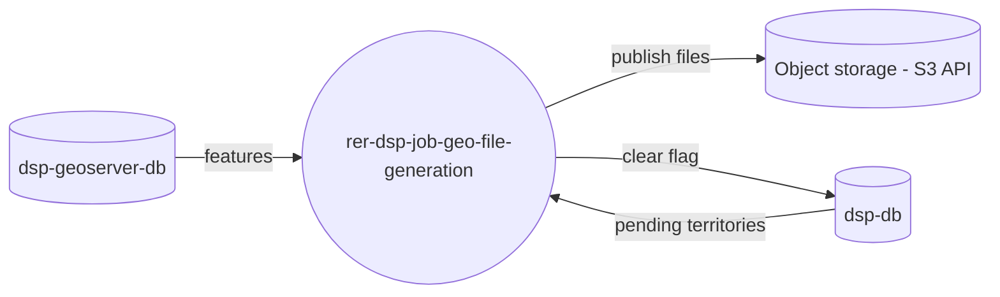

# rer-dsp-job-geo-file-generation

> This repository is one module of the **DSP (Data Sharing Platform)**, part of the RER ecosystem.
> Full project documentation lives in **[rer-dsp-docs](https://github.com/Rural-Environmental-Registry/rer-dsp-docs)**.
> The information below covers this module only, not the DSP project as a whole.

## Where this module fits in the DSP



## Purpose

Pre-generate territorial download files (levels 2 and 3) and publish them to S3-compatible
object storage so the backend does not need to query WFS on every download.

## How it works

1. Migration ([`rer-dsp-job-data-migration`](https://github.com/Rural-Environmental-Registry/rer-dsp-job-data-migration))
   sets `requires_s3_file_regeneration` on changed territories, only after finishing successfully.
2. This job reads pending territories from `dsp.territory_level_2` / `dsp.territory_level_3`.
3. For each territory, it walks enabled themes from `downloadThemesConfig.json` and the
   formats each theme declares.
4. Exports the file by reading `dsp-geoserver-db` — the same database WFS reads, which keeps
   content equivalent.
5. Publishes at `{format}/{level}/{slug}_{theme}.{ext}` with `generated-at` (PutObject instant,
   ISO UTC) in user metadata — the backend uses this as `lastFileGenerated`.
6. Only when all enabled formats for the territory have been published does
   `requires_s3_file_regeneration` go back to `false` and `last_generated_s3_file_at` get written.
   Partial failure keeps the territory pending for the next run.

If the bucket does not exist, the job logs the error, publishes nothing and exits without failing —
flags stay on and the next run tries again.

### Object key

| Level | Key |
| ----- | ----- |
| 2 | `{format}/level-2/{level2Slug}_{themeCode}.{ext}` |
| 3 | `{format}/level-3/{level2Slug}_{level3Slug}_{themeCode}.{ext}` |

The slug comes from `name` (lowercase, no accents, rest becomes hyphens). Level 3 includes the
parent slug because homonyms across parents are common. The API and flags still use `id`.

The filename the end user downloads is **not** the object key: the backend still builds
`{theme}_{level2}.{ext}`.

### Formats

v1 generates **CSV**, in the same format WFS returns (`FID` column, attributes in table order,
geometry as WKT). A new format is added by implementing `GeoFileExporter` and declaring the
format in the theme's `formats[]` — object keys and endpoints do not change.

### Orphan cleanup

At the end, the job lists `{format}/level-2/` and `{format}/level-3/` and deletes anything that
does not match an existing (territory, theme, format). That is how renaming a territory stops
serving the old file.

## Technologies

Java 21, Spring Boot 3.4.2, Spring Batch, PostgreSQL/PostGIS, AWS SDK v2 (S3), Maven.

## Configuration

Three datasources (`batch`, `target`, `geo-target`) and object storage.

The `batch` datasource points to schema **`geo_file_generation`** on `dsp-db` (Spring Batch metadata
for this job). Schema `data_migration` is exclusive to the
[migration job](https://github.com/Rural-Environmental-Registry/rer-dsp-job-data-migration).

```yaml
spring:
  datasource:
    batch:
      url: jdbc:postgresql://dsp-db:5432/dsp-db?currentSchema=geo_file_generation
dsp:
  object-storage:
    endpoint: http://storage:9000   # S3 API endpoint
    region: us-east-1
    bucket: dsp-geo-files           # must exist; the job does not create it
    access-key: ...
    secret-key: ...
    path-style-access: true
```

The runtime file is generated by `rer-dsp-core`
(`config/Job-Geo-File-Generation/application/application.yaml`).

## How to run

```bash
./mvnw spring-boot:run
```

Or, preferably, via `rer-dsp-core` (`./setup.sh`), which orchestrates the full stack.

## License

[GNU General Public License v3.0](LICENSE)
